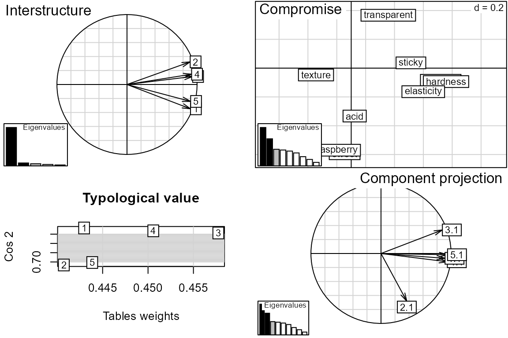

# C. Unsupervised multiblock analysis

``` r

# Start the multiblock R package
library(multiblock)
#> Registered S3 method overwritten by 'lme4':
#>   method           from
#>   na.action.merMod car
#> Registered S3 method overwritten by 'plsVarSel':
#>   method       from
#>   print.mvrVal pls
#> Registered S3 methods overwritten by 'multiblock':
#>   method             from
#>   print.multiblock   ade4
#>   summary.multiblock ade4
#> 
#> Attaching package: 'multiblock'
#> The following object is masked from 'package:stats':
#> 
#>     loadings
```

## Unsupervised methods

The following unsupervised methods are available in the *multiblock*
package (function names in parentheses):

- SCA - Simultaneous Component Analysis (*sca*)
- GCA - Generalised Canonical Analysis (*gca*)
- GPA - Generalised Procrustes Analysis (*gpa*)
- MFA - Multiple Factor Analysis (*mfa*)
- PCA-GCA (*pcagca*)
- DISCO - Distinct and Common Components with SCA (*disco*)
- HPCA - Hierarchical Principal component analysis (*hpca*)
- MCOA - Multiple Co-Inertia Analysis (*mcoa*)
- JIVE - Joint and Individual Variation Explained (*jive*)
- STATIS - Structuration des Tableaux à Trois Indices de la Statistique
  (*statis*)
- HOGSVD - Higher Order Generalized SVD (*hogsvd*)

The following sections will describe how to format your data for
analysis and invoke all methods from the list above.

## Formatting data for multiblock data analysis

Data blocks are best stored as named lists for use with unsupervised
methods in this package. If also column names and row names are used for
all blocks, these can be used for easy labelling in plots supplied by
the *pls* package. See examples below for illustrations of this.

``` r

# Load potato data
data(potato)
class(potato)
#> [1] "data.frame"
# data.frames can contain matrices as variables, 
# thus becoming object linked lists of blocks.
str(potato[1:3])
#> 'data.frame':    26 obs. of  3 variables:
#>  $ Chemical   : 'AsIs' num [1:26, 1:14] 3.21 3.26 5.18 3.75 2.92 ...
#>   ..- attr(*, "dimnames")=List of 2
#>   .. ..$ : chr [1:26] "1" "2" "3" "4" ...
#>   .. ..$ : chr [1:14] "PEU" "Sta." "TotN" "Phy." ...
#>  $ Compression: 'AsIs' num [1:26, 1:12] 2.23 1.21 1.63 2.68 2.85 ...
#>   ..- attr(*, "dimnames")=List of 2
#>   .. ..$ : chr [1:26] "1" "2" "3" "4" ...
#>   .. ..$ : chr [1:12] "FW20" "BW20" "ST20" "SH20" ...
#>  $ NIRraw     : 'AsIs' num [1:26, 1:1050] -0.831 -0.807 -0.836 -0.78 -0.769 ...
#>   ..- attr(*, "dimnames")=List of 2
#>   .. ..$ : chr [1:26] "1" "2" "3" "4" ...
#>   .. ..$ : chr [1:1050] "400" "402" "404" "406" ...

# Explicit conversion to a list
potList <- as.list(potato[1:3])
str(potList)
#> List of 3
#>  $ Chemical   : 'AsIs' num [1:26, 1:14] 3.21 3.26 5.18 3.75 2.92 ...
#>   ..- attr(*, "dimnames")=List of 2
#>   .. ..$ : chr [1:26] "1" "2" "3" "4" ...
#>   .. ..$ : chr [1:14] "PEU" "Sta." "TotN" "Phy." ...
#>  $ Compression: 'AsIs' num [1:26, 1:12] 2.23 1.21 1.63 2.68 2.85 ...
#>   ..- attr(*, "dimnames")=List of 2
#>   .. ..$ : chr [1:26] "1" "2" "3" "4" ...
#>   .. ..$ : chr [1:12] "FW20" "BW20" "ST20" "SH20" ...
#>  $ NIRraw     : 'AsIs' num [1:26, 1:1050] -0.831 -0.807 -0.836 -0.78 -0.769 ...
#>   ..- attr(*, "dimnames")=List of 2
#>   .. ..$ : chr [1:26] "1" "2" "3" "4" ...
#>   .. ..$ : chr [1:1050] "400" "402" "404" "406" ...
```

## Method interfaces

All unsupervised methods supplied by this package share a common
interface which expects a list of blocks as the first input. Methods
that are imported from other packages are wrapped in a function that
gives the mentioned interface. Results from the imported method are
stored in a separate slot in the output in case specialised *plot* or
*summary* functions are available or direct inspection is needed. If
default parameters are used, a single list of blocks with suitably
linked matrices (shared objects or variables) will result in a basic
analysis (see first code block below). In addition, all methods have
parameters that control their behaviour, e.g., number of components,
convergence criteria etc.

### Shared sample mode

The following block of code loads a multiblock data set, extracts three
blocks and runs through all included unsupervised methods having shared
sample mode using the same interface.

``` r

# Object linked data
data(potato)
potList <- as.list(potato[c(1,2,9)])

suppressWarnings( # FactoMineR <=2.3 uses recycling of length 1 array.
invisible({capture.output({ # DISCOsca in package RegularizedSCA is highly verbose.
pot.sca    <- sca(potList)
pot.gca    <- gca(potList)
pot.gpa    <- gpa(potList)
pot.mfa    <- mfa(potList)
pot.pcagca <- pcagca(potList)
pot.disco  <- disco(potList)
pot.hpca   <- hpca(potList)
pot.mcoa   <- mcoa(potList)
})}))
```

### Shared variable mode

The following block of code loads a sensory data set, extracts blocks
and runs through all included unsupervised methods having shared
variable mode using the same interface.

``` r

# Shared variable mode data
data(candies)
candyList  <- lapply(1:nlevels(candies$candy), function(x)candies$assessment[candies$candy==x,])

invisible({capture.output({ # jive in package r.jive is highly verbose.
can.sca    <- sca(candyList, samplelinked = FALSE)
can.jive   <- jive(candyList)
can.statis <- statis(candyList)
can.hogsvd <- hogsvd(candyList)
})})
```

### Common output elements across methods

Output from all methods include slots called *loadings*, *scores*,
*blockLoadings* and *blockScores*, or a suitable subset of these. An
*info* slot describes which types of (block) loadings/scores are in the
output. There may be various extra elements in addition to the common
elements, e.g. coefficients, weights etc.

``` r

# SCA used with shared variable mode data returns block loadings and common scores:
names(pot.sca)
#> [1] "blockLoadings" "scores"        "samplelinked"  "info"         
#> [5] "explvar"       "call"          "data"
summary(pot.sca)
#> Simultaneous Component Analysis 
#> =============================== 
#> 
#> $scores: Common scores (26x2)
#> $blockLoadings: Block loadings:
#> - Chemical (14x2), Compression (12x2), Sensory (9x2)
# MFA stores individual PCA scores and loadings as block elements:
names(pot.mfa)
#> [1] "loadings"    "blockScores" "scores"      "blockScores" "info"       
#> [6] "call"
summary(pot.mfa)
#> Nothing computed 
#> ================ 
#> 
#> $scores: Not used (2x2)
#> $loadings: Not used (2x2)
#> $blockScores: Not used:
#> - (2x2), (2x2), (2x2)
```

### Scores and loadings

Functions for accessing scores and loadings are based on functions from
the *pls* package, but extended with a *block* parameter to allow
extraction of common/global scores/loadings and their block
counterparts. The default block is 0, corresponding to the common/global
block. Block scores/loadings can be accessed by number or name.

``` r

# Global scores plotted with object labels
scoreplot(pot.sca, labels = "names")
```


``` r

# Block loadings for Sensory block with variable labels in scatter format
loadingplot(pot.sca, block = "Sensory", labels = "names")
```


``` r

# Non-existing elements are swapped with existing ones with a warning.
sc <- scores(pot.sca, block = 1)
#> Warning in scores.multiblock(pot.sca, block = 1): No block scores. Returning
#> global/consensus scores.
```

### Plot from imported package

Some methods in the package are wrappers for imported methods from other
packages. Using the stored object from an imported method (see \$statis
code below), one can exploit methods from the original package to expand
on the methods available in this package. An example is the summary plot
for the *statis* method in the package *ade4*.

``` r

# Apply a plot function from ade4 (no extra import required).
plot(can.statis$statis)
```


