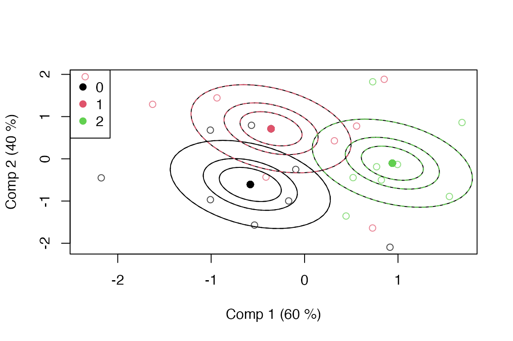
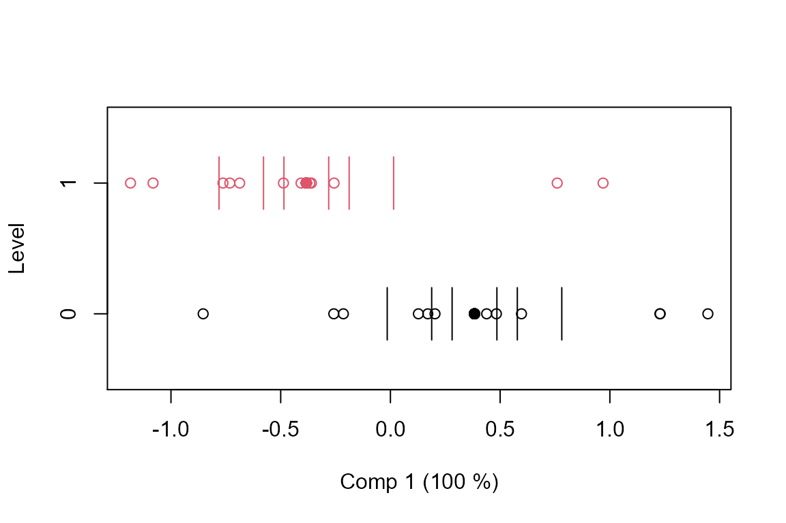

# D. ASCA

``` r

library(multiblock)
#> Registered S3 method overwritten by 'lme4':
#>   method           from
#>   na.action.merMod car
#> Registered S3 method overwritten by 'plsVarSel':
#>   method       from
#>   print.mvrVal pls
#> Registered S3 methods overwritten by 'multiblock':
#>   method             from
#>   print.multiblock   ade4
#>   summary.multiblock ade4
#> 
#> Attaching package: 'multiblock'
#> The following object is masked from 'package:stats':
#> 
#>     loadings
```

## ANOVA Simultaneous Component Analysis – ASCA

The following example uses a simulated dataset for showcasing some of
the possibilities of the ASCA method.

### Simulated data

Two categorical factors and a covariate are simulated together with a
standard normal set of 10 responses.

``` r

set.seed(1)
dataset   <- data.frame(y = I(matrix(rnorm(24*10), ncol = 10)), 
                        x = factor(c(rep(2,8), rep(1,8), rep(0,8))), 
                        z = factor(rep(c(1,0), 12)), w = rnorm(24))
colnames(dataset$y) <- paste('Var', 1:10, sep = " ")
rownames(dataset)   <- paste('Obj', 1:24, sep = " ")
str(dataset)
#> 'data.frame':    24 obs. of  4 variables:
#>  $ y: 'AsIs' num [1:24, 1:10] -0.626 0.184 -0.836 1.595 0.33 ...
#>   ..- attr(*, "dimnames")=List of 2
#>   .. ..$ : NULL
#>   .. ..$ : chr [1:10] "Var 1" "Var 2" "Var 3" "Var 4" ...
#>  $ x: Factor w/ 3 levels "0","1","2": 3 3 3 3 3 3 3 3 2 2 ...
#>  $ z: Factor w/ 2 levels "0","1": 2 1 2 1 2 1 2 1 2 1 ...
#>  $ w: num  0.707 1.034 0.223 -0.879 1.163 ...
```

### Formula interface

This ASCA implementation uses R’s formula interface for model
specification. This means that the first argument is a formula with
response on the left and design on the right, separated by a tilde
operator, e.g. *y ~ x + z* or *assessment ~ assessor + candy*. The names
in the formula refer to variables in a data.frame (or list). Separation
with plus (*+*) adds main effects to the model, while separation by
stars (*\**) adds main effects and interactions, e.g. *y ~ x \* z*.
Colons (*:*) can be used for explicit interactions, e.g. *y ~ x + z +
x:z*. More complicated formulas exist, but only a simple subset is
supported by *asca*.

### ASCA modelling

A basic ASCA model having two factors is fitted and printed as follows.

``` r

mod <- asca(y~x+z, data = dataset)
print(mod)
#> Anova Simultaneous Component Analysis fitted using 'lm' (Linear Model)
#> Call:
#> asca(formula = y ~ x + z, data = dataset)
```

### Scores

Scores for first factor are extracted and a scoreplot with confidence
ellipsoids is produced.

``` r

sc <- scores(mod)
head(sc)
#>          Comp 1     Comp 2
#> Obj 1 0.9395791 -0.1039977
#> Obj 2 0.9395791 -0.1039977
#> Obj 3 0.9395791 -0.1039977
#> Obj 4 0.9395791 -0.1039977
#> Obj 5 0.9395791 -0.1039977
#> Obj 6 0.9395791 -0.1039977

scoreplot(mod, legendpos = "topleft", ellipsoids = "confidence")
```



This is repeated for the second factor.

``` r

sc <- scores(mod, factor = "z")
head(sc)
#>           Comp 1
#> Obj 1 -0.3831621
#> Obj 2  0.3831621
#> Obj 3 -0.3831621
#> Obj 4  0.3831621
#> Obj 5 -0.3831621
#> Obj 6  0.3831621

scoreplot(mod, factor = "z", ellipsoids = "confidence")
```



### Loadings

A basic loadingplot for the first factor is generated using graphics
from the *pls* package.

``` r

lo <- loadings(mod)
head(lo)
#>            Comp 1      Comp 2
#> Var 1 -0.03688007 -0.15615007
#> Var 2 -0.01764472 -0.05590506
#> Var 3  0.14250312  0.06184430
#> Var 4 -0.50220715 -0.35817451
#> Var 5 -0.54263018  0.45252899
#> Var 6  0.44399942 -0.01293480

loadingplot(mod, scatter = TRUE, labels = 'names')
```


