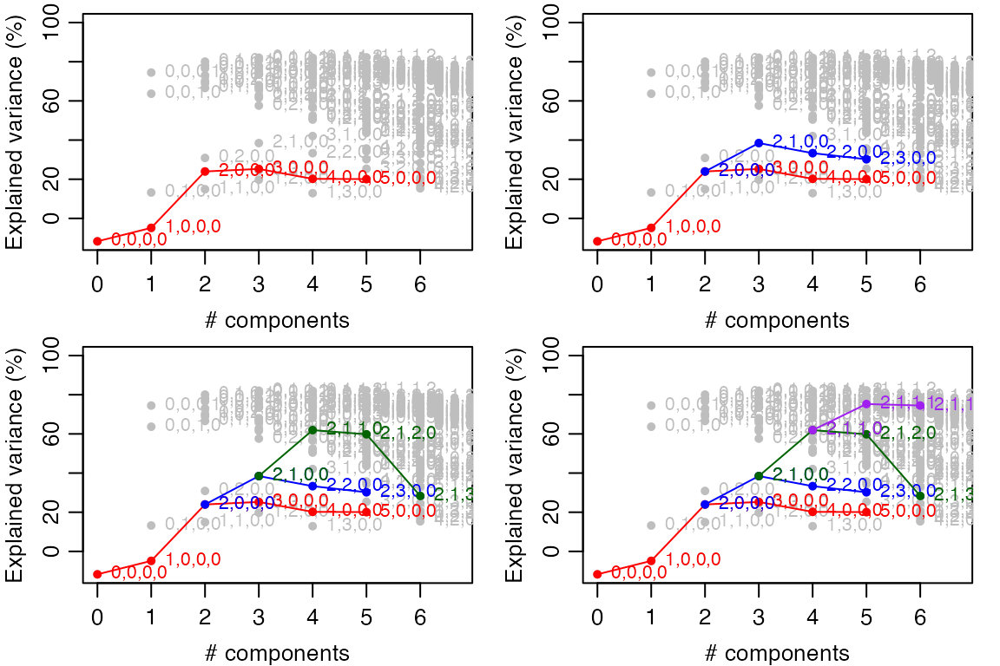
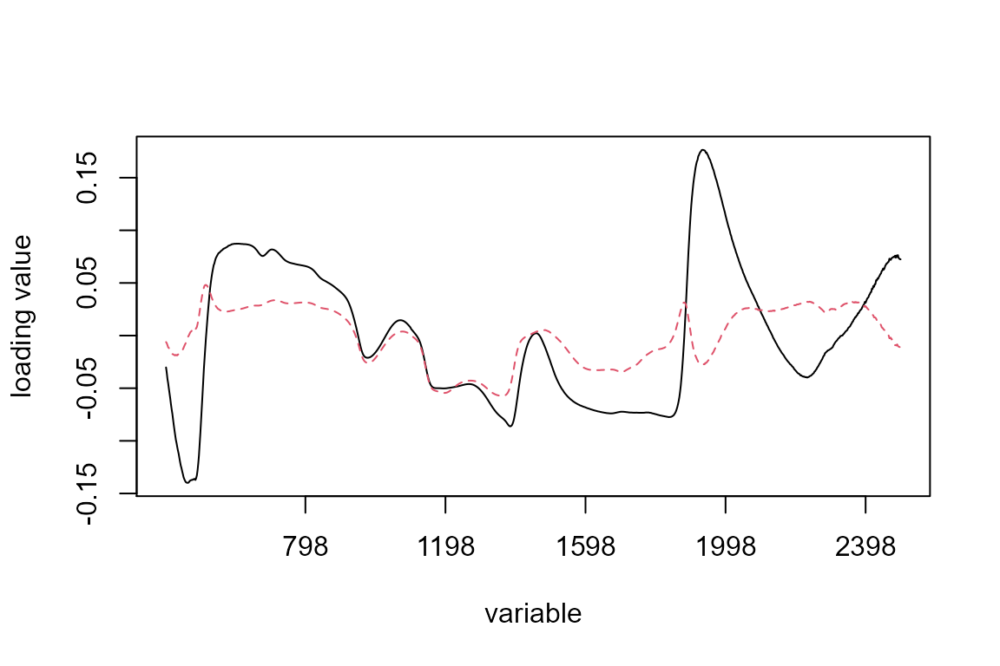
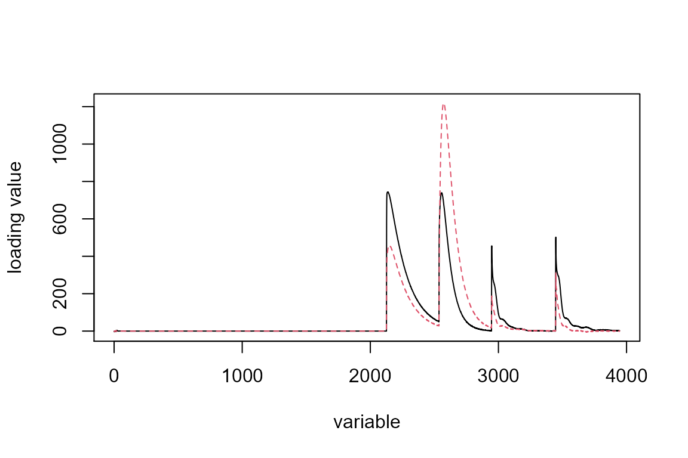
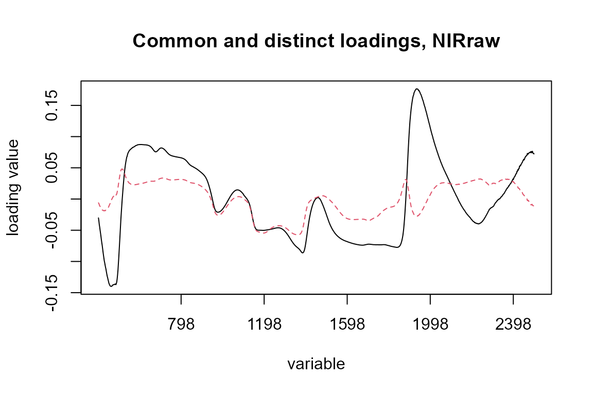
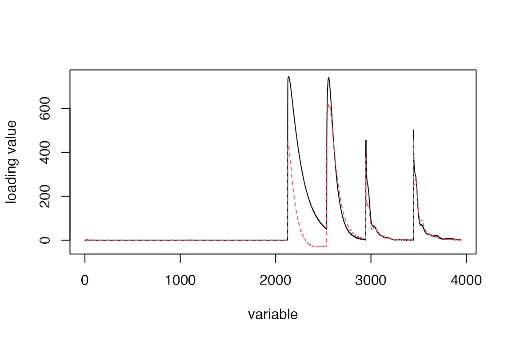
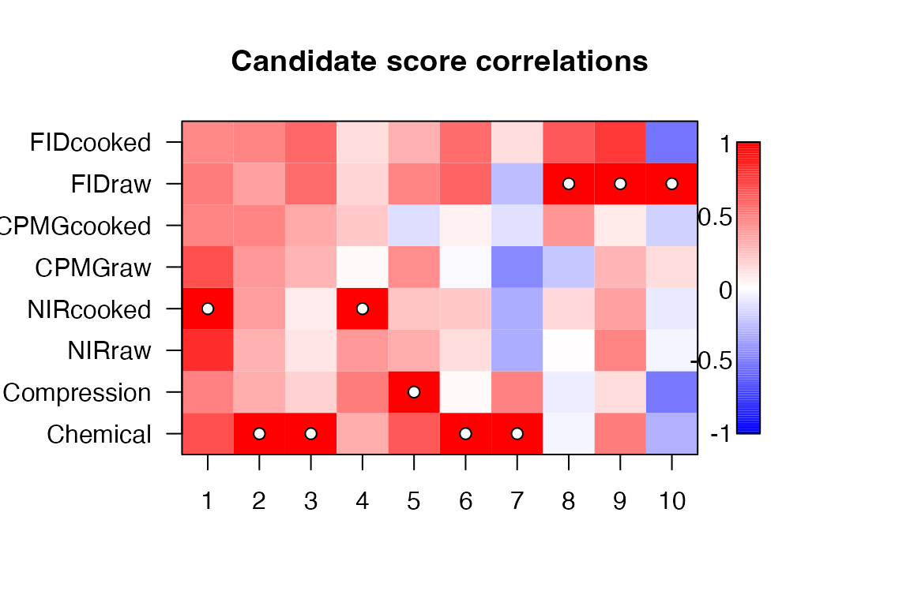
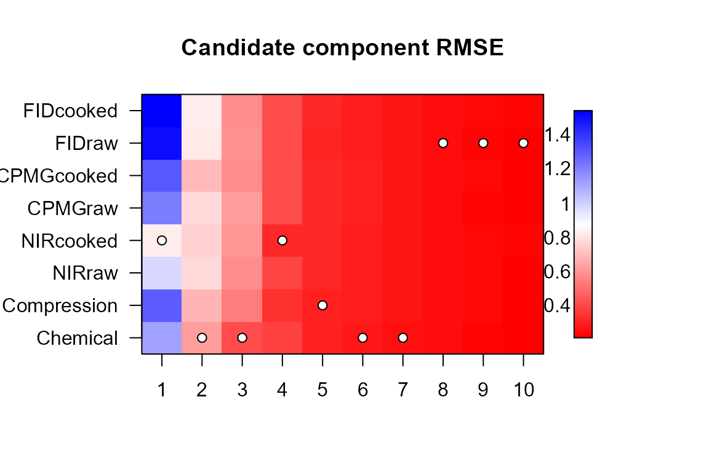

# E. Supervised multiblock analysis

``` r

library(multiblock)
#> Registered S3 method overwritten by 'lme4':
#>   method           from
#>   na.action.merMod car
#> Registered S3 method overwritten by 'plsVarSel':
#>   method       from
#>   print.mvrVal pls
#> Registered S3 methods overwritten by 'multiblock':
#>   method             from
#>   print.multiblock   ade4
#>   summary.multiblock ade4
#> 
#> Attaching package: 'multiblock'
#> The following object is masked from 'package:stats':
#> 
#>     loadings
```

## Supervised methods

The following supervised methods are available in the *multiblock*
package (function names in parentheses):

- MB-PLS - Multiblock Partial Least Squares (*mbpls*)
- sMB-PLS - Sparse Multiblock Partial Least Squares (*smbpls*)
- SO-PLS - Sequential and Orthogonalised PLS (*sopls*)
- PO-PLS - Parallel and Orthogonalised PLS (*popls*)
- ROSA - Response Oriented Sequential Alternation (*rosa*)
- mbRDA - Multiblock Redundancy Analysis (*mbrda*)

The following sections will describe how to format your data for
analysis and invoke all methods from the list above.

## Formatting data for multiblock analyses

Data blocks are best stored as named lists for use with the formula
interface of R. The following is an example with sample data in one data
block and one response block.

``` r

# Random data
n <- 30; p <- 90
X <- matrix(rnorm(n*p), nrow=n)
y <- X %*% rnorm(p) + 10

# Split X into three blocks in a named list
ABC <- list(A = X[,1:20], B = X[,21:50], C = X[,51:90], y = y)

# Model using names of blocks (see below for full SO-PLS example)
so.abc <- sopls(y ~ A + B + C, data = ABC, ncomp = c(4,3,4))
```

## Multiblock Partial Least Squares - MB-PLS

Multiblock PLS is presented briefly using the *potato* data.

### Modelling

A multi-response two-block MB-PLS model with up to 10 components in
total is cross-validated with 10 random segments.

``` r

data(potato)
mb <- mbpls(X=potato[c('Chemical','Compression')], Y=potato[['Sensory']], ncomp=10,
            max_comps=10, validation="CV", segments=10)
print(mb)
#> Multiblock PLS 
#> 
#> Call:
#> mbpls(X = potato[c("Chemical", "Compression")], Y = potato[["Sensory"]],     ncomp = 10, max_comps = 10, validation = "CV", segments = 10)
```

### Summaries and plotting

MB-PLS is implemented as a block-wise weighted concatenated ordinary
PLSR. Therefore, all methods available for *plsr* are available for the
global part of the MB-PL. In addition one can extrac *blockScores* and
*blockLoadings*.

``` r

Tb1 <- scores(mb, block=1)
scoreplot(mb, block = 1, labels = "names")
```


``` r


Pb2 <- loadings(mb, block=2)
loadingplot(mb, block = 1, labels = "names")
```


## Sparse Multiblock Partial Least Squares - sMB-PLS

Sparse MB-PLS is presented briefly using the *potato* data.

### Modelling

A multi-response two-block sMB-PLS model with up to 10 components in
total is cross-validated with 10 random segments. Here, the
Soft-Threshold version is used (Truncation version also available) with
parameter *shrink = 0.6* which means the loading weights have 60% of the
largest values subtracted before setting negative values to 0.

``` r

data(potato)
smb <- smbpls(X=potato[c('Chemical','Compression')], Y=potato[['Sensory']], ncomp = 10,
            max_comps=10, shrink = 0.6, validation="CV", segments=10)
print(smb)
#> Sparse Multiblock PLS (Soft-Threshold) 
#> 
#> Call:
#> smbpls(X = potato[c("Chemical", "Compression")], Y = potato[["Sensory"]],     ncomp = 10, shrink = 0.6, max_comps = 10, validation = "CV",     segments = 10)
```

### Plotting

We demonstrate the effect of shrinkage on scores and sparseness in
loading weights by plotting results for three values of the shrinkage
parameter. In the loading weight plots we can follow the shrinkage
toward the origin of each variable, while the score plots show the
effect on the sample scores.

``` r

old.par <- par(mfrow = c(3,2), mar = c(3.5,3.5,1.5,1), mgp = c(2,1,0))
for(shrink in c(0.2, 0.5, 0.8)){
  smb <- smbpls(X=potato[c('Chemical','Compression')], Y=potato[['Sensory']], ncomp = 10,
            max_comps=10, shrink = shrink)
  scoreplot(smb, labels = "names", main = paste0("Superscores, shrink=", shrink))
  loadingweightplot(smb, labels = "names", main = paste0("Super-loading weights, shrink=", shrink))
}
```


``` r

par(old.par)
```

## Sequential and orthogonalised PLS - SO-PLS

The following example uses the *potato* data to showcase some of the
functions available for SO-PLS analyses.

### Modelling

A multi-response two-block SO-PLS model with up to 10 components in
total is cross-validated with 10 random segments.

``` r

# Load potato data and fit SO-PLS model
so.pot <- sopls(Sensory ~ Chemical + Compression, data=potato, 
            ncomp=c(10,10), max_comps=10, validation="CV", segments=10)
print(so.pot)
#> Sequential and Orthogonalized Partial Least Squares, fitted with the PKPLS algorithm.
#> Cross-validated using 10 random segments.
#> Call:
#> sopls(formula = Sensory ~ Chemical + Compression, ncomp = c(10,     10), max_comps = 10, data = potato, validation = "CV", segments = 10)
summary(so.pot)
#> Data:    X dimension: 26 0 
#>  Y dimension: 26 9
#> Fit method: PKPLS
#> Number of components considered: 10
#> 
#> VALIDATION: RMSEP
#> Cross-validated using 10 random segments.
#>    0,0     0,1     0,2     0,3     0,4     0,5     0,6     0,7     0,8     0,9  
#> 1.1158  0.9873  0.9928  0.9950  1.0357  1.2615  1.1828  1.2614  1.2782  1.2562  
#>   0,10     1,0     1,1     1,2     1,3     1,4     1,5     1,6     1,7     1,8  
#> 1.2398  0.8544  0.8194  0.8627  0.8087  0.8705  0.9283  0.9292  1.0142  1.0404  
#>    1,9     2,0     2,1     2,2     2,3     2,4     2,5     2,6     2,7     2,8  
#> 1.0814  0.7251  0.6321  0.6218  0.6717  0.6814  0.7237  0.7493  0.8037  0.8713  
#>    3,0     3,1     3,2     3,3     3,4     3,5     3,6     3,7     4,0     4,1  
#> 0.6773  0.6544  0.6424  0.7171  0.7314  0.7555  0.8011  0.8634  0.6764  0.6475  
#>    4,2     4,3     4,4     4,5     4,6     5,0     5,1     5,2     5,3     5,4  
#> 0.6430  0.6922  0.7042  0.7299  0.7479  0.6888  0.6866  0.6806  0.7391  0.7475  
#>    5,5     6,0     6,1     6,2     6,3     6,4     7,0     7,1     7,2     7,3  
#> 0.8826  0.7014  0.7131  0.6972  0.7783  0.7960  0.7124  0.7253  0.7091  0.8079  
#>    8,0     8,1     8,2     9,0     9,1    10,0  
#> 0.7604  0.7683  0.7434  0.7426  0.7576  1.3878  
#> 
#> TRAINING: % variance explained
#>         0,0    0,1    0,2    0,3    0,4    0,5    0,6    0,7    0,8    0,9
#> X         0  45.87  55.51  62.90  66.46  67.73  74.95  78.26  79.85  82.39
#> ref       0  42.19  54.73  65.01  66.85  73.96  74.10  74.44  77.45  77.57
#> hard      0  39.11  41.97  42.23  43.80  50.95  54.87  56.78  59.50  74.53
#> firm      0  42.55  57.44  59.44  61.06  66.78  68.62  69.02  71.34  76.53
#> elas      0  38.64  65.31  73.51  75.63  77.23  79.25  81.19  83.71  86.57
#> adhes     0  16.13  18.11  26.71  26.74  29.70  42.07  44.57  46.47  46.54
#> grainy    0  23.21  43.78  62.23  64.02  67.18  67.72  69.83  74.79  74.79
#> mealy     0  35.35  41.99  57.36  58.84  67.17  70.33  73.21  77.77  78.88
#> moist     0  24.48  27.71  43.10  44.27  48.41  53.39  62.37  67.60  74.79
#> chewi     0  21.98  22.78  48.17  55.50  59.96  68.39  72.54  76.39  77.42
#>          0,10    1,0    1,1    1,2    1,3    1,4    1,5    1,6    1,7    1,8
#> X       83.18  34.20  64.12  71.71  76.24  78.20  79.49  83.37  84.42  85.59
#> ref     77.57  55.79  64.00  64.25  73.75  77.39  79.53  80.42  80.50  80.96
#> hard    75.43  24.10  41.42  44.05  44.07  44.09  47.61  53.70  53.86  62.46
#> firm    79.31  42.73  54.16  58.42  62.05  63.55  64.91  70.85  70.91  70.93
#> elas    88.14  53.24  59.32  63.95  71.43  74.51  75.33  77.16  78.86  78.88
#> adhes   54.68  17.49  22.70  33.54  33.75  34.70  34.90  39.43  48.51  48.92
#> grainy  74.82  57.69  58.26  58.39  71.89  75.95  76.07  76.72  77.73  79.00
#> mealy   79.25  61.37  65.64  66.70  74.33  75.36  77.44  78.35  79.55  80.15
#> moist   77.22  57.32  58.51  62.12  66.20  66.35  67.13  67.14  69.51  71.02
#> chewi   81.68  53.27  54.25  64.22  66.35  69.59  69.96  72.80  77.64  77.64
#>           1,9    2,0    2,1    2,2    2,3    2,4    2,5    2,6    2,7    2,8
#> X       86.07  42.76  72.61  79.40  81.41  82.69  84.98  88.16  88.87  89.84
#> ref     81.20  76.03  85.17  87.21  89.03  90.67  90.68  91.36  91.36  91.39
#> hard    69.98  25.29  44.10  46.63  46.63  46.88  52.03  61.89  64.48  73.84
#> firm    80.21  55.93  69.19  76.45  76.45  76.80  77.79  82.58  82.64  86.03
#> elas    87.63  63.10  70.21  78.03  78.08  78.17  80.37  82.19  84.54  85.69
#> adhes   49.97  34.43  39.48  46.70  46.78  48.48  54.50  56.16  67.45  72.74
#> grainy  79.50  83.95  84.78  87.19  88.01  88.56  89.28  89.29  89.30  89.49
#> mealy   80.19  81.14  85.67  85.68  87.94  88.28  88.57  89.15  89.69  90.49
#> moist   72.44  67.94  69.06  70.49  72.51  72.53  72.61  72.80  73.61  78.69
#> chewi   78.05  70.55  71.41  77.11  77.11  78.09  78.17  79.79  83.27  86.51
#>           3,0    3,1    3,2    3,3    3,4    3,5    3,6    3,7    4,0    4,1
#> X       63.76  78.59  84.55  86.77  87.73  90.09  91.81  92.46  70.09  80.35
#> ref     84.50  86.31  87.91  89.34  91.72  91.74  93.12  93.13  84.91  87.28
#> hard    29.51  45.43  50.00  50.23  51.56  54.69  61.12  63.12  30.80  49.39
#> firm    62.42  68.64  76.93  76.96  77.84  78.25  82.67  82.72  62.64  73.46
#> elas    69.44  70.75  78.04  78.06  78.07  80.60  82.75  85.36  69.94  73.16
#> adhes   34.51  46.88  50.83  51.04  51.60  57.45  58.26  69.10  64.76  65.66
#> grainy  87.18  87.45  88.87  89.86  90.34  91.06  91.37  91.45  87.20  87.21
#> mealy   84.89  86.14  86.18  88.32  89.25  89.48  91.02  91.95  88.83  88.96
#> moist   70.03  70.05  72.13  74.57  74.71  74.88  74.97  76.40  75.09  76.33
#> chewi   70.56  72.61  77.34  77.39  78.58  78.58  79.89  83.77  82.06  82.29
#>           4,2    4,3    4,4    4,5    4,6    5,0    5,1    5,2    5,3    5,4
#> X       87.12  88.89  89.78  92.03  93.37  75.21  84.27  91.16  92.52  93.47
#> ref     88.13  89.65  92.48  92.54  93.63  85.03  88.23  89.16  90.27  92.85
#> hard    49.95  50.65  50.76  54.96  60.99  41.38  53.88  54.08  54.33  54.70
#> firm    77.00  77.10  77.44  78.23  83.34  68.24  75.97  78.78  78.78  79.40
#> elas    78.98  79.09  79.43  82.78  83.85  72.35  74.56  79.87  80.48  80.91
#> adhes   67.28  68.26  69.21  70.41  70.90  64.77  65.81  67.35  67.83  69.01
#> grainy  89.07  90.46  91.63  92.15  92.30  87.53  87.56  89.67  90.98  91.93
#> mealy   88.99  93.13  94.52  94.64  95.00  89.21  89.65  89.73  93.45  94.51
#> moist   76.60  82.33  82.90  82.90  83.28  79.72  79.91  79.98  83.86  84.08
#> chewi   84.08  84.45  86.24  86.38  86.39  82.11  82.31  83.97  84.76  86.45
#>           5,5    6,0    6,1    6,2    6,3    6,4    7,0    7,1    7,2    7,3
#> X       95.40  77.28  86.22  93.18  94.55  95.63  79.57  88.43  95.46  96.65
#> ref     92.91  86.80  90.43  91.47  92.26  94.07  88.07  91.60  92.62  92.70
#> hard    60.53  45.27  56.94  57.05  57.64  59.71  45.28  56.91  56.99  57.22
#> firm    80.75  68.98  76.56  79.17  79.42  80.55  69.02  76.72  79.16  79.35
#> elas    83.34  72.55  74.96  80.08  80.15  80.26  73.76  76.39  81.36  81.61
#> adhes   70.53  64.77  65.79  67.29  69.17  69.37  65.04  65.96  67.53  68.89
#> grainy  92.38  91.29  91.41  93.80  94.06  94.27  91.78  91.89  94.29  94.34
#> mealy   94.83  90.67  91.24  91.36  94.83  95.44  92.38  92.87  92.98  94.77
#> moist   84.08  82.80  82.90  82.93  85.65  85.67  85.12  85.26  85.29  86.55
#> chewi   86.50  84.60  84.72  86.16  86.49  87.50  86.05  86.22  87.61  87.62
#>           8,0    8,1    8,2    9,0    9,1   10,0
#> X       82.82  88.16  95.96  85.49  90.21  87.08
#> ref     90.82  94.67  94.93  91.52  94.42  91.79
#> hard    52.73  59.90  60.33  52.75  63.37  52.92
#> firm    71.26  80.42  80.49  71.81  80.88  71.82
#> elas    73.78  80.71  81.41  75.22  80.15  76.14
#> adhes   68.88  68.89  69.28  71.74  72.73  74.17
#> grainy  91.80  93.21  94.39  91.99  92.91  92.43
#> mealy   93.59  94.05  94.31  93.75  93.98  93.83
#> moist   86.40  86.60  87.34  87.11  88.40  87.14
#> chewi   87.11  88.40  88.43  87.27  89.53  87.28
```

### Måge plot

A full Måge plot for all combinations of components for all blocks is
produced. This can be used for a global search for the best fitting
cross-validated model.

Each point in the figure below is accompanied by a sequence of four
numbers referring to the number of components used for each of the four
blocks. Horizontal location is given by the total number of components
used across all blocks, while vertical location indicates validated
explained variance in percentage.

``` r

# Load Wine data and model with SO-PLS
data(wine)
ncomp <- unlist(lapply(wine, ncol))[-5]
so.wine <- sopls(`Global quality` ~ ., data=wine, ncomp=ncomp, 
             max_comps=6, validation="CV", segments=10)
maage(so.wine)
```


A sequential Måge plot can be used for a sequential search for the
optimal model.

``` r

# Sequential search for optimal number of components per block
old.par <- par(mfrow=c(2,2), mar=c(3,3,0.5,1), mgp=c(2,0.7,0))
maageSeq(so.wine)
maageSeq(so.wine, 2)
maageSeq(so.wine, c(2,1))
maageSeq(so.wine, c(2,1,1))
```



``` r

par(old.par)
```

### Loadings

One set of loadings is printed and two sets are plotted to show how to
select specific components from specific blocks. When extracting or
plotting loadings for the second or later blocks, one must specify how
many components have been used in the previous block(s) (*ncomp*) as
this will affect the choice of loadings. In addition one can specify
which components in the current block should be extracted (*comps*).

``` r

# Display loadings for first block
loadings(so.pot, block = 1)
#> 
#> Loadings:
#>      1,0    2,0    3,0    4,0    5,0    6,0    7,0    8,0    9,0    10,0  
#> PEU   0.645 -3.672  1.197  2.277 -0.589 -1.684  1.028  0.431  0.118 -0.132
#> Sta. -4.542 -0.975 -0.984 -0.678 -0.559 -0.926 -0.418 -0.583  0.508  0.220
#> TotN  0.478 -1.848  3.046 -1.613  1.604 -1.088  1.441  0.355 -1.874       
#> Phy. -3.970        -1.445  0.948  1.148 -0.286  1.519 -0.669  0.233 -1.415
#> Ca   -1.365 -0.982  1.804 -1.190 -3.763  1.249  0.107  0.281 -0.401 -1.229
#> Mg   -4.009 -0.280        -2.344  0.996 -0.320  1.152  0.172  0.801  0.481
#> Na   -3.066 -2.488  0.669  1.616 -1.119  1.520 -0.570 -0.430 -0.452  1.440
#> K    -0.186 -0.255 -4.161  0.149  0.700  1.225 -1.469  1.284 -1.263 -0.411
#> Hi.1 -4.493  2.113         0.344 -0.226        -0.126  0.108 -0.154  0.162
#> Hi.2 -4.099  2.656 -0.739  0.488 -0.311 -0.225  0.135  0.120 -0.254  0.146
#> Hi.3 -4.382  2.270 -0.259  0.398 -0.272 -0.271  0.105  0.337 -0.369       
#> Hi.4  3.000  0.732 -2.855        -1.994 -0.483  1.552 -0.173 -0.200  0.528
#> Hi.5 -4.419  2.023 -0.177  0.372 -0.362 -0.359  0.192  0.494 -0.668       
#> Hi.6  1.580  2.266 -3.570  0.571 -1.131 -0.664  1.351 -0.390 -0.371  0.279
#> 
#>                    1,0    2,0    3,0    4,0    5,0    6,0    7,0    8,0    9,0
#> SS loadings    151.624 51.586 56.326 19.671 27.054 11.370 13.749  3.605  7.288
#> Proportion Var  10.830  3.685  4.023  1.405  1.932  0.812  0.982  0.257  0.521
#> Cumulative Var  10.830 14.515 18.538 19.943 21.876 22.688 23.670 23.927 24.448
#>                  10,0
#> SS loadings     6.470
#> Proportion Var  0.462
#> Cumulative Var 24.910
```

``` r

# Plot loadings from block 1 and 2
old.par <- par(mfrow=c(1,2))
loadingplot(so.pot, comps = c(2,3), block = 1, main = "Block 1", labels = "names", cex = 0.8)
loadingplot(so.pot, ncomp = 4, block = 2, main = "Block 2", labels = "names", cex = 0.8)
```


``` r

par(old.par)
```

### Scores

One set of scores is printed and two sets are plotted to show how to
select specific components from specific blocks. Specification of
component use in preceding blocks follows the same pattern as with
loadings.

``` r

# Display scores for first block
scores(so.pot, block = 1)
#>             1,0         2,0          3,0         4,0         5,0          6,0
#> 1  -0.078379126 -0.15756558 -0.030150796 -0.08882899 -0.01376296 -0.056671801
#> 2   0.033599245  0.03345139 -0.264837392 -0.02082345 -0.11717078 -0.151392736
#> 3  -0.454087240 -0.50387774 -0.257625630  0.24822188 -0.02903093 -0.086528935
#> 4  -0.010144029  0.04409907  0.254739277  0.34206013  0.02495265  0.074552441
#> 5  -0.231320589  0.02813994  0.331647163 -0.15209020 -0.75827354  0.341572360
#> 6  -0.100806072 -0.03203490  0.058511494 -0.07824489 -0.03272086  0.022355259
#> 7   0.103759602  0.05587580  0.171495995  0.13245956 -0.01979756 -0.159062060
#> 8   0.142341829 -0.02952316  0.135315864  0.17766566 -0.04381490 -0.186272842
#> 9   0.160175421 -0.13395363  0.067732083 -0.34567441  0.17107748  0.172779015
#> 10  0.078862890 -0.20282246  0.065251294 -0.21205811  0.20044571  0.328237338
#> 11  0.200245777 -0.02882659  0.149667777 -0.08872396 -0.08768916 -0.174332305
#> 12  0.223602068 -0.07321286 -0.029748834 -0.22950703 -0.03709102 -0.193124707
#> 13  0.217320106 -0.26815383  0.096949900 -0.10070260  0.05733144 -0.253089620
#> 14  0.142847549 -0.29951537  0.077252287  0.24996525 -0.11362892 -0.187257376
#> 15  0.213820293  0.17228886 -0.461863019 -0.11767172 -0.27195381 -0.069378444
#> 16  0.164964325  0.26005269 -0.323577542  0.10235857 -0.18083698  0.028860577
#> 17  0.002967383  0.19480792 -0.246885356  0.19701818  0.05083294  0.193040181
#> 18  0.066258347  0.09356886 -0.228532411  0.20484080  0.06435515  0.193713440
#> 19  0.194213760 -0.01568159  0.132000297  0.14447620  0.07380230  0.134307084
#> 20  0.141301554 -0.07654188  0.049224760  0.26084474  0.16978368  0.406994445
#> 21 -0.129888279  0.04471652  0.038982799 -0.30565064  0.07729299 -0.272193959
#> 22 -0.105636544  0.24576605 -0.030041538 -0.14535670  0.24832087  0.010288729
#> 23 -0.464479945 -0.11433433 -0.194275154 -0.06714686  0.13063332 -0.005785022
#> 24 -0.082441922  0.22751259  0.233417343  0.13675311  0.22568931 -0.091378804
#> 25 -0.325181587  0.44765983  0.208213841  0.07217114  0.05115869 -0.267361478
#> 26 -0.103914818  0.08810440 -0.002864502 -0.31635566  0.16009487  0.247129222
#>             7,0          8,0         9,0         10,0
#> 1  -0.170176673 -0.353657625  0.09144069 -0.188197767
#> 2   0.376363608 -0.223166913 -0.06432803  0.102154561
#> 3   0.053642203  0.053088656  0.11136825  0.089274658
#> 4   0.080021975 -0.455836399  0.29151166  0.160435908
#> 5   0.060316124  0.088814534 -0.01259842 -0.241887363
#> 6  -0.143868448  0.209487156  0.44247087  0.460290223
#> 7  -0.067499572  0.172789197 -0.01007070  0.014280187
#> 8   0.003023123  0.020901351 -0.15855793  0.115799243
#> 9   0.099124600  0.077168263 -0.22926057  0.020019625
#> 10 -0.006546077  0.001048562 -0.15821313  0.090958585
#> 11 -0.321845257 -0.388050068 -0.15769574  0.033224651
#> 12 -0.114302438 -0.157344716  0.01456158 -0.118230072
#> 13  0.159102296  0.426179096  0.31221443 -0.244022144
#> 14  0.164565349  0.160117465 -0.31148972  0.004138940
#> 15  0.160269738 -0.034424824  0.04760954  0.177518448
#> 16  0.073035199  0.028396505  0.02512587  0.008674474
#> 17 -0.336494502  0.228154141 -0.02760929 -0.191196309
#> 18 -0.353315626  0.070825686  0.13990043 -0.255631862
#> 19 -0.192020302  0.118534017 -0.05488875  0.206887988
#> 20  0.167499146 -0.065961803 -0.17176149 -0.018385084
#> 21 -0.291917226 -0.005778312  0.06774798 -0.093267865
#> 22  0.315505112  0.055322691 -0.04212437 -0.272120565
#> 23 -0.070388026 -0.103937894 -0.28625584 -0.102958571
#> 24  0.271169417 -0.112282869  0.28534458 -0.337006550
#> 25 -0.033293058  0.199555988 -0.33284978  0.259557484
#> 26  0.118029313 -0.009941885  0.18840789  0.319689179
#> attr(,"explvar")
#>       1,0       2,0       3,0       4,0       5,0       6,0       7,0       8,0 
#> 34.201725  8.556741 20.999993  6.330308  5.124745  2.071311  2.284023  3.250427 
#>       9,0      10,0 
#>  2.674759  1.582372 
#> attr(,"class")
#> [1] "scores.multiblock" "scores"
```

``` r

# Plot scores from block 1 and 2
old.par <- par(mfrow=c(1,2))
scoreplot(so.pot, comps = c(2,3), block = 1, main = "Block 1", labels = "names")
scoreplot(so.pot, ncomp = 4, block = 2, main = "Block 2", labels = "names")
```


``` r

par(old.par)
```

### Prediction

A three block model is fitted using a single response, 5 components and
a subset of the data. The remaining data are used as test set for
prediction.

``` r

# Modify data to contain a single response
potato1 <- potato; potato1$Sensory <- potato1$Sensory[,1]
# Model 20 first objects with SO-PLS
so.pot20 <- sopls(Sensory ~ ., data = potato1[c(1:3,9)], ncomp = 5, subset = 1:20)
# Predict remaining objects
testset <- potato1[-(1:20),]; # testset$Sensory <- NULL
predict(so.pot20, testset, comps=c(2,1,2))
#> , , 1,0,0
#> 
#>       Sensory
#> [1,] 3.710097
#> [2,] 3.508955
#> [3,] 6.066989
#> [4,] 3.521423
#> [5,] 4.944123
#> [6,] 3.539052
#> 
#> , , 2,0,0
#> 
#>       Sensory
#> [1,] 3.636431
#> [2,] 3.610855
#> [3,] 6.429357
#> [4,] 3.393957
#> [5,] 4.062585
#> [6,] 3.449857
#> 
#> , , 3,0,0
#> 
#>       Sensory
#> [1,] 3.688660
#> [2,] 3.685508
#> [3,] 6.480693
#> [4,] 3.211579
#> [5,] 3.956964
#> [6,] 3.464106
#> 
#> , , 4,0,0
#> 
#>       Sensory
#> [1,] 3.746689
#> [2,] 3.545318
#> [3,] 6.342659
#> [4,] 2.980819
#> [5,] 3.631846
#> [6,] 3.419858
#> 
#> , , 5,0,0
#> 
#>       Sensory
#> [1,] 3.741608
#> [2,] 3.034433
#> [3,] 6.123613
#> [4,] 2.363783
#> [5,] 2.979181
#> [6,] 3.078927
#> 
#> , , 5,1,0
#> 
#>       Sensory
#> [1,] 3.636086
#> [2,] 2.582345
#> [3,] 6.196188
#> [4,] 1.914878
#> [5,] 2.804766
#> [6,] 3.092452
#> 
#> , , 5,2,0
#> 
#>       Sensory
#> [1,] 3.847071
#> [2,] 3.105369
#> [3,] 6.731938
#> [4,] 1.914845
#> [5,] 2.913156
#> [6,] 3.201600
#> 
#> , , 5,3,0
#> 
#>       Sensory
#> [1,] 4.339639
#> [2,] 3.956609
#> [3,] 8.709663
#> [4,] 2.405164
#> [5,] 3.544869
#> [6,] 3.771154
#> 
#> , , 5,4,0
#> 
#>       Sensory
#> [1,] 4.791787
#> [2,] 4.211071
#> [3,] 8.738256
#> [4,] 2.547092
#> [5,] 3.635783
#> [6,] 3.771432
#> 
#> , , 5,5,0
#> 
#>       Sensory
#> [1,] 4.896776
#> [2,] 4.273363
#> [3,] 9.041290
#> [4,] 2.462006
#> [5,] 3.738154
#> [6,] 3.987452
#> 
#> , , 5,5,1
#> 
#>       Sensory
#> [1,] 5.127082
#> [2,] 4.593908
#> [3,] 9.859248
#> [4,] 2.409637
#> [5,] 4.392888
#> [6,] 4.321865
#> 
#> , , 5,5,2
#> 
#>       Sensory
#> [1,] 4.893680
#> [2,] 4.293595
#> [3,] 8.950756
#> [4,] 2.643839
#> [5,] 4.549016
#> [6,] 3.825176
#> 
#> , , 5,5,3
#> 
#>       Sensory
#> [1,] 4.809765
#> [2,] 3.407967
#> [3,] 8.351415
#> [4,] 1.533916
#> [5,] 3.098735
#> [6,] 2.980523
#> 
#> , , 5,5,4
#> 
#>        Sensory
#> [1,]  5.206516
#> [2,]  3.827037
#> [3,] 10.217326
#> [4,]  1.880369
#> [5,]  5.232344
#> [6,]  4.708891
#> 
#> , , 5,5,5
#> 
#>        Sensory
#> [1,]  4.910730
#> [2,]  3.410653
#> [3,] 11.063789
#> [4,]  1.817420
#> [5,]  6.038563
#> [6,]  6.823995
```

### Validation

Compute validation statistics; explained variance - R$`^2`$, and Root
Mean Squared Error - RMSE(P/CV).

``` r

# Cross-validation
R2(so.pot, ncomp = c(5,5))
#>       1,0       2,0       3,0       4,0       5,0       5,1       5,2       5,3 
#> 0.3725766 0.5481465 0.6057872 0.6068032 0.5922717 0.5948811 0.6019672 0.5305786 
#>       5,4       5,5 
#> 0.5197773 0.3305448
R2(so.pot, ncomp = c(5,5), individual = TRUE)
#>               1,0         2,0         3,0        4,0        5,0        5,1
#> ref    0.36214407  0.56469277  0.68930955  0.6980272  0.6732567  0.7030829
#> hard   0.01554864 -0.06554243 -0.02356978 -0.2066266 -0.3179983 -0.1581612
#> firm   0.17665535  0.26163730  0.38041565  0.2897483  0.3544505  0.4301413
#> elas   0.39850777  0.48863848  0.54675908  0.5277118  0.5160369  0.5020343
#> adhes  0.07664970  0.18245255  0.09638291  0.2584602  0.3250433  0.3029435
#> grainy 0.38583269  0.70597919  0.76691993  0.7667584  0.7786072  0.7315524
#> mealy  0.47737188  0.70616954  0.75003068  0.7922686  0.7768048  0.7559721
#> moist  0.49447042  0.60410772  0.59662575  0.5536880  0.5432058  0.4865251
#> chewi  0.46983344  0.61391521  0.55336390  0.6374355  0.5546693  0.5298323
#>               5,2         5,3         5,4        5,5
#> ref     0.7410001  0.69827926  0.74704423  0.7648513
#> hard   -0.1980853 -0.36660169 -0.73821865 -1.3368093
#> firm    0.4757700  0.40266089  0.25687178 -0.1025061
#> elas    0.5624613  0.57145052  0.54102462  0.3000614
#> adhes   0.2322958  0.07395787  0.08853579 -1.1018881
#> grainy  0.7676007  0.76075064  0.74369076  0.7864572
#> mealy   0.7471824  0.68717433  0.73071507  0.6895273
#> moist   0.4318475  0.26213711  0.26483590 -0.1588749
#> chewi   0.5093917  0.39328706  0.36162629 -0.1487673
# Training
R2(so.pot, 'train', ncomp = c(5,5))
#>       1,0       2,0       3,0       4,0       5,0       5,1       5,2       5,3 
#> 0.5321195 0.7063309 0.7545212 0.7890377 0.8065415 0.8303087 0.8419431 0.8603538 
#>       5,4       5,5 
#> 0.8735251 0.8807225

# Test data
R2(so.pot20, newdata = testset, ncomp = c(2,1,2))
#>      1,0,0      2,0,0      2,1,0      2,1,1      2,1,2 
#>  0.5217279  0.7330829  0.7208834  0.4494703 -0.2607736
```

``` r

# Cross-validation
RMSEP(so.pot, ncomp = c(5,5))
#>       1,0       2,0       3,0       4,0       5,0       5,1       5,2       5,3 
#> 0.8544463 0.7251089 0.6772824 0.6764090 0.6887948 0.6865871 0.6805560 0.7390705 
#>       5,4       5,5 
#> 0.7475251 0.8826025
RMSEP(so.pot, ncomp = c(5,5), individual = TRUE)
#>              1,0       2,0       3,0       4,0       5,0       5,1       5,2
#> ref    1.3651285 1.1277431 0.9527439 0.9392823 0.9770473 0.9313863 0.8698854
#> hard   0.7295578 0.7590108 0.7439116 0.8076981 0.8441508 0.7913108 0.8048343
#> firm   0.7862604 0.7445784 0.6820650 0.7302671 0.6962101 0.6541226 0.6273884
#> elas   0.5670081 0.5228032 0.4921968 0.5024326 0.5086046 0.5159100 0.4835957
#> adhes  0.5876289 0.5529380 0.5813158 0.5266077 0.5024096 0.5105684 0.5358175
#> grainy 0.8539775 0.5908703 0.5260847 0.5262669 0.5127254 0.5645896 0.5253158
#> mealy  1.1098846 0.8322041 0.7675820 0.6997333 0.7253103 0.7584051 0.7719428
#> moist  0.7712617 0.6825226 0.6889419 0.7246825 0.7331432 0.7772990 0.8176378
#> chewi  0.5778388 0.4931078 0.5303682 0.4778517 0.5295925 0.5441604 0.5558633
#>              5,3       5,4       5,5
#> ref    0.9388902 0.8596755 0.8288645
#> hard   0.8595746 0.9694263 1.1240205
#> firm   0.6697088 0.7469773 0.9098421
#> elas   0.4786022 0.4953007 0.6116517
#> adhes  0.5884849 0.5838345 0.8865939
#> grainy 0.5330016 0.5516774 0.5035534
#> mealy  0.8586826 0.7966865 0.8554471
#> moist  0.9317863 0.9300807 1.1677417
#> chewi  0.6181476 0.6340712 0.8505827
# Training
RMSEP(so.pot, 'train', ncomp = c(5,5))
#>       1,0       2,0       3,0       4,0       5,0       5,1       5,2       5,3 
#> 0.7378564 0.5845659 0.5344553 0.4954580 0.4744585 0.4443592 0.4288556 0.4031058 
#>       5,4       5,5 
#> 0.3836247 0.3725492

# Test data
RMSEP(so.pot20, newdata = testset, ncomp = c(2,1,2))
#>    1,0,0    2,0,0    2,1,0    2,1,1    2,1,2 
#> 1.562727 1.167438 1.193819 1.676625 2.537255
```

### Principal Components of Predictions

A PCA is computed from the cross-validated predictions to get an
overview of the SO-PLS model across all involved blocks. The blocks are
projected onto the scores to form block-loadings to see how these relate
to the solution.

``` r

# PCP from so.pot object
PCP <- pcp(so.pot, c(3,2))
summary(PCP)
#> Principal Components of Predictions 
#> =================================== 
#> 
#> $scores: Scores (26x9)
#> $loadings: Loadings (9x9)
#> $blockLoadings: Block loadings:
#> - Chemical (14x9), Compression (12x9)
scoreplot(PCP)
```


``` r

corrplot(PCP)
```



### CVANOVA

A CVANOVA model compares absolute or squared cross-validated residuals
from two or more prediction models using ANOVA with *Model* and *Object*
as effects. Tukey’s pair-wise testing is automatically computed in this
implementation.

``` r

# CVANOVA
so.pot1 <- sopls(Sensory[,1] ~ Chemical + Compression + NIRraw, data=potato, 
            ncomp=c(10,10,10), max_comps=10, validation="CV", segments=10)
cva <- cvanova(so.pot1, "2,1,2")
summary(cva)
#> Analysis of Variance Table
#> 
#> Response: Residual
#>           Df  Sum Sq Mean Sq F value   Pr(>F)    
#> Model      2  0.5585 0.27925  3.7044  0.03161 *  
#> Object    25 16.5196 0.66079  8.7657 5.89e-11 ***
#> Residuals 50  3.7691 0.07538                     
#> ---
#> Signif. codes:  0 '***' 0.001 '**' 0.01 '*' 0.05 '.' 0.1 ' ' 1
#> Tukey's HSD
#> Alpha: 0.05
#> 
#>            Mean G1 G2
#> 2,0,0 0.8929078     B
#> 2,1,0 0.7742818  A  B
#> 2,1,2 0.6863993  A
old.par <- par(mar = c(4,6,4,2))
plot(cva)
```


``` r

par(old.par)
```

## Parallel and Orthgonalised Partial Least Squares - PO-PLS

PO-PLS is presented briefly using the *potato* data. It is a method for
separating predictive information into common, local and distinct parts.

### Modelling

There are many choices with regard to numbers of components and possible
local and common components. Using automatic selection, the user selects
the highest number of blocks to combine into local/common components,
minimum explained variance and minimum squared correlation to the
response. Manual selection can be done by setting the number of initial
components from the blocks and maximum number of local/common
components.

``` r

# Automatic analysis
pot.po.auto <- popls(potato[1:3], potato[['Sensory']][,1], commons = 2)
#> Warning in gca.svd(X = X, tol = tol, ncomp = ncomp): 'ncomp' reduced due to low
#> singular value for block 1
#> Warning in gca.svd(X = X, tol = tol, ncomp = ncomp): 'ncomp' reduced due to low
#> singular value for block 1

# Explained variance
pot.po.auto$explVar
#> $Chemical
#> named numeric(0)
#> 
#> $Compression
#> C(1,2), Comp 1 
#>       68.14595 
#> 
#> $NIRraw
#> D(3), Comp 1 
#>     42.53836
```

``` r

# Manual choice of up to 5 components for each block and 1, 0, and 2 blocks,
# respectively from the (1,2), (1,3) and (2,3) combinations of blocks.
pot.po.man <- popls(potato[1:3], potato[['Sensory']][,1], commons = 2,
                    auto=FALSE, manual.par = list(ncomp=c(5,5,5),
                                                  ncommon=c(1,0,2)))
#> Warning in gca.svd(X = X, tol = tol, ncomp = ncomp): 'ncomp' reduced due to low
#> singular value for block 1
#> Warning in gca.svd(X = X, tol = tol, ncomp = ncomp): 'ncomp' reduced due to low
#> singular value for block 1
# Explained variance
pot.po.man$explVar
#> $Chemical
#> C(1,2), Comp 1   D(1), Comp 1   D(1), Comp 2   D(1), Comp 3 
#>    32.22943509    20.74356738    20.87956167     0.04446336 
#> 
#> $Compression
#> C(1,2), Comp 1 C(2,3), Comp 1 C(2,3), Comp 2 
#>      68.145954       5.504006       7.214911 
#> 
#> $NIRraw
#> C(2,3), Comp 1 C(2,3), Comp 2 
#>      32.606459       5.475702
```

### Scores and loadings

Scores and loadings are stored per block. Common scores/loadings are
found in each of the blocks’ list of components.

``` r

# Score plot for local (2,3) components
scoreplot(pot.po.man, block = 3, labels = "names")
```



``` r


# Corresponding loadings
loadingplot(pot.po.man, block = 3, labels="names", scatter = FALSE)
```



## Response Oriented Sequential Alternation - ROSA

The following example uses the *potato* data to showcase some of the
functions available for ROSA analyses.

### Modelling

A multi-response two-block ROSA model with up to 10 components in total
is cross-validated with 10 random segments.

``` r

# Model all eight potato blocks with ROSA
ros.pot <- rosa(Sensory ~ ., data = potato1, ncomp = 10, validation = "CV", segments = 5)
print(ros.pot)
#> Response Orinented Sequential Alternation , fitted with the CPPLS algorithm.
#> Cross-validated using 5 random segments.
#> Call:
#> rosa(formula = Sensory ~ ., ncomp = 10, data = potato1, validation = "CV",     segments = 5)
summary(ros.pot)
#> Data:    X dimension: 26 3946 
#>  Y dimension: 26 1
#> Fit method:
#> Number of components considered: 10
#> 
#> VALIDATION: RMSEP
#> Cross-validated using 5 random segments.
#>        (Intercept)  1 comps  2 comps  3 comps  4 comps  5 comps  6 comps
#> CV           1.778    1.381    1.239   0.9998   0.8072   0.7546   0.5884
#> adjCV        1.778    1.284    1.136   0.9019   0.7151   0.6722   0.5356
#>        7 comps  8 comps  9 comps  10 comps
#> CV      0.5397   0.5464   0.6237    0.7192
#> adjCV   0.4959   0.5021   0.5652    0.6547
#> 
#> TRAINING: % variance explained
#>          1 comps  2 comps  3 comps  4 comps  5 comps  6 comps  7 comps  8 comps
#> X          27.82    40.72    47.95    49.48    53.96    55.28    57.79    65.49
#> Sensory    76.54    86.77    94.07    96.47    97.03    97.49    97.83    98.03
#>          9 comps  10 comps
#> X          67.14     68.16
#> Sensory    98.28     98.51
```

### Loadings

Extract loadings (not used further) and plot two first vectors of
loadings.

``` r

loads <- loadings(ros.pot)
loadingplot(ros.pot, comps = 1:2, scatter = FALSE)
```



### Scores

Extract scores (not used further) and plot two first vectors of scores.

``` r

sco <- scores(ros.pot)
scoreplot(ros.pot, comps = 1:2, labels = "names")
```


### Prediction

A three block model is fitted using a single response, 5 components and
a subset of the data. The remaining data are used as test set for
prediction.

``` r

# Model 20 first objects of three potato blocks
rosT <- rosa(Sensory ~ ., data = potato1[c(1:3,9)], ncomp = 5, subset = 1:20)
testset <- potato1[-(1:20),]; # testset$Sensory <- NULL
predict(rosT, testset, comps=2)
#>     Sensory
#> 21 3.845579
#> 22 3.101318
#> 23 3.928266
#> 24 2.771968
#> 25 2.538627
#> 26 2.876964
```

### Validation

Compute validation statistics; explained variance - R$`^2`$ and Root
Mean Squared Error - RMSE(P/CV).

``` r

# Cross-validation
R2(ros.pot)
#> (Intercept)      1 comps      2 comps      3 comps      4 comps      5 comps  
#>     -0.0816       0.3474       0.4748       0.6578       0.7770       0.8051  
#>     6 comps      7 comps      8 comps      9 comps     10 comps  
#>      0.8815       0.9003       0.8978       0.8668       0.8230
# Training
R2(ros.pot, 'train')
#> (Intercept)      1 comps      2 comps      3 comps      4 comps      5 comps  
#>      0.0000       0.7654       0.8677       0.9407       0.9647       0.9703  
#>     6 comps      7 comps      8 comps      9 comps     10 comps  
#>      0.9749       0.9783       0.9803       0.9828       0.9851

# Test data
R2(rosT, 'test', newdata = testset)
#> (Intercept)      1 comps      2 comps      3 comps      4 comps      5 comps  
#>     -0.1609       0.3158       0.3365       0.3562       0.4299       0.4217
```

``` r

# Cross-validation
RMSEP(ros.pot)
#>        (Intercept)  1 comps  2 comps  3 comps  4 comps  5 comps  6 comps
#> CV           1.778    1.381    1.239   0.9998   0.8072   0.7546   0.5884
#> adjCV        1.778    1.284    1.136   0.9019   0.7151   0.6722   0.5356
#>        7 comps  8 comps  9 comps  10 comps
#> CV      0.5397   0.5464   0.6237    0.7192
#> adjCV   0.4959   0.5021   0.5652    0.6547
# Training
RMSEP(ros.pot, 'train')
#> (Intercept)      1 comps      2 comps      3 comps      4 comps      5 comps  
#>      1.7093       0.8279       0.6216       0.4163       0.3213       0.2948  
#>     6 comps      7 comps      8 comps      9 comps     10 comps  
#>      0.2710       0.2515       0.2397       0.2241       0.2083

# Test data
RMSEP(rosT, newdata = testset)
#> (Intercept)      1 comps      2 comps      3 comps      4 comps      5 comps  
#>       2.435        1.869        1.841        1.813        1.706        1.718
```

### Image plots

These are plots for evaluation of the block selection process in ROSA.
Correlation plots show how the different candidate scores (one candidate
for each block for each component) correlate to the winning block’s
scores. Residual response plots show how different choices of candidate
scores would affect the RMSE of the residual response. One can for
instance use these plots to decide on a different block selection order
than the one proposed automatically by ROSA.

``` r

# Correlation to winning scores
image(ros.pot)
```



``` r

# Residual response given candidate scores
image(ros.pot, "residual")
```



## Multiblock Redundancy Analysis - mbRDA

The following example uses the *potato* data to showcase some of the
functions available for mbRDA analyses.

### Modelling

This implementation uses a wrapper for the *mbpcaiv* function in the
*ade4* package to perform mbRDA. A multi-response 5 component model is
fitted.

``` r

# Convert data.frame with AsIs objects to list of matrices
potatoList <- lapply(potato, unclass)

# Perform mbRDA with two blocks explaining sensory attributes
mbr <- mbrda(X = potatoList[c('Chemical','Compression')], Y = potatoList[['Sensory']], ncomp = 5)
print(mbr)
#> Multiblock RDA 
#> 
#> Call:
#> mbrda(X = potatoList[c("Chemical", "Compression")], Y = potatoList[["Sensory"]],     ncomp = 5)
```

### Loadings and scores

The *mbpcaiv* wrapper extracts key elements for inspection using the
same format as the rest of this package. The full fitted *mbpcaiv*
object is also available, e.g. through *mbr\$mbpcaivObject*.

``` r

# Extract and view loadings
lo_mbr <- loadings(mbr)
#> Warning in loadings.multiblock(mbr): No global/consensus loadings available.
#> Returning block 1 loadings.
print(head(lo_mbr))
#>           Comp 1      Comp 2     Comp 3     Comp 4     Comp 5
#> PEU  -0.11801083  0.45883565 -1.7606202 -0.1936109 -2.3704052
#> Sta.  1.02113965 -2.99539512  1.4968283  4.6426038 -7.6478047
#> TotN  0.50084474 -1.40837541  1.0571404  1.8302797 -1.7127587
#> Phy.  0.24298763  0.27655908  0.3695837  0.4462580 -0.7461178
#> Ca    0.02050271 -0.04647818  0.1311656  0.6243666 -0.9713523
#> Mg   -0.21159305  1.41437345 -0.6562877 -1.4166021  2.0111970
# Plot scores
scoreplot(mbr, labels = "names")
```


