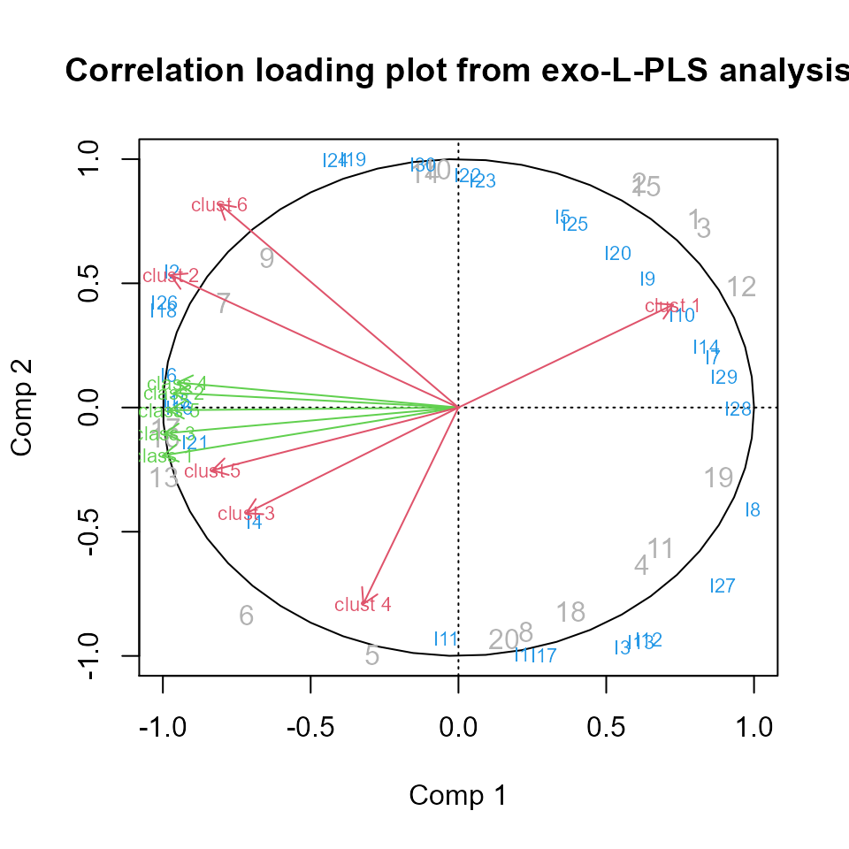

# F. Complex multiblock analysis

``` r

# Start the multiblock R package
library(multiblock)
#> Registered S3 method overwritten by 'lme4':
#>   method           from
#>   na.action.merMod car
#> Registered S3 method overwritten by 'plsVarSel':
#>   method       from
#>   print.mvrVal pls
#> Registered S3 methods overwritten by 'multiblock':
#>   method             from
#>   print.multiblock   ade4
#>   summary.multiblock ade4
#> 
#> Attaching package: 'multiblock'
#> The following object is masked from 'package:stats':
#> 
#>     loadings
```

## Complex data structures

The following methods for complex data structures are available in the
*multiblock* package (function names in parentheses):

- L-PLS - Partial Least Squares in L configuration (*lpls*)
- SO-PLS-PM - Sequential and Orthogonalised PLS Path Modeling
  (*sopls_pm*)

### L-PLS

To showcase L-PLS we will use simulated data specifically made for
L-shaped data. Regression using L-PLS can be either outwards from *X1*
to *X2* and *X3* or inwards from *X2* and *X3* to *X1*. In the former
case, prediction can either be of *X2* or *X3* given *X1*.
Cross-validation is performed either on the rows of *X1* or the columns
of *X1*.

       ______N 
      |       |
      |       |
      |  X3   |
      |       |
     K|_______|
                 
                 
       ______N       ________J 
      |       |     |         |
      |       |     |         |
      |  X1   |     |   X2    |
      |       |     |         |
     I|_______|    I|_________|

### Simulated L-shaped data

We simulate two latent components in L shape with blocks having
dimensions (30x20), (20x5) and (6x20) for blocks *X1*, *X2* and *X3*,
respectively.

``` r

set.seed(42)

# Simulate data set
sim <- lplsData(I = 30, N = 20, J = 5, K = 6, ncomp = 2)

# Split into separate blocks
X1  <- sim$X1; X2 <- sim$X2; X3 <- sim$X3
```

### Exo-L-PLS

The first L-PLS will be outwards. Predictions have to be accompanied by
a direction.

``` r

# exo-L-PLS:
lp.exo  <- lpls(X1,X2,X3, ncomp = 2) # type = "exo" is default

# Predict X1
pred.exo.X2 <- predict(lp.exo, X1new = X1, exo.direction = "X2")

# Predict X3
pred.exo.X2 <- predict(lp.exo, X1new = X1, exo.direction = "X3")

# Correlation loading plot
plot(lp.exo)
```



### Endo-L-PLS

The second L-PLS will be inwards.

``` r

# endo-L-PLS:
lp.endo <- lpls(X1,X2,X3, ncomp = 2, type = "endo")

# Predict X1 from X2 and X3 (in this case fitted values):
pred.endo.X1 <- predict(lp.endo, X2new = X2, X3new = X3)
```

### L-PLS cross-validation

Cross-validation comes with choices of directions when applying this to
L-PLS since we have both sample and variable links. The cross-validation
routines compute RMSECV values and perform cross-validated predictions.

``` r

# LOO cross-validation horizontally
lp.cv1 <- lplsCV(lp.exo, segments1 = as.list(1:dim(X1)[1]), trace = FALSE)

# LOO cross-validation vertically
lp.cv2 <- lplsCV(lp.exo, segments2 = as.list(1:dim(X1)[2]), trace = FALSE)

# Three-fold CV, horizontal
lp.cv3 <- lplsCV(lp.exo, segments1 = as.list(1:10, 11:20, 21:30), trace = FALSE)

# Three-fold CV, horizontal, inwards model
lp.cv4 <- lplsCV(lp.endo, segments1 = as.list(1:10, 11:20, 21:30), trace = FALSE)
```

### SO-PLS Path Modelling

The following example uses the *potato* data and the *wine* data to
showcase some of the functions available for SO-PLS-PM analyses.

#### Single SO-PLS-PM model

A model with four blocks having 5 components per input block is fitted.
We set *computeAdditional* to *TRUE* to turn on computation of
additional explained variance per added block in the model.

``` r

# Load potato data
data(potato)

# Single path
pot.pm <- sopls_pm(potato[1:3], potato[['Sensory']], c(5,5,5), computeAdditional=TRUE)

# Report of explained variances and optimal number of components .
# Bootstrapping can be enabled to assess stability.
# (LOO cross-validation is default)
pot.pm
#>  direct indirect     total additional1 additional2 overall
#>   0 (0)    52.44 52.44 (3)    4.09 (3)   14.01 (2)   70.55
```

#### Multiple paths in an SO-PLS-PM model

A model containing five blocks is fitted. Explained variances for all
sub-paths are estimated.

``` r

# Load wine data
data(wine)

# All path in the forward direction
pot.pm.multiple <- sopls_pm_multiple(wine, ncomp = c(4,2,9,8))

# Report of direct, indirect and total explained variance per sub-path.
# Bootstrapping can be enabled to assess stability.
pot.pm.multiple
#> $`Smell at rest->View`
#>     direct indirect     total
#>  32.68 (1)        0 32.68 (1)
#> 
#> $`Smell at rest->Smell after shaking`
#>  direct indirect     total
#>   0 (0)    40.03 40.03 (4)
#> 
#> $`Smell at rest->Tasting`
#>  direct indirect     total
#>   0 (0)    11.52 11.52 (2)
#> 
#> $`Smell at rest->Global quality`
#>  direct indirect     total
#>   0 (0)    25.25 25.25 (3)
#> 
#> $`View->Smell after shaking`
#>     direct indirect     total
#>  30.97 (2)        0 30.97 (2)
#> 
#> $`View->Tasting`
#>  direct indirect     total
#>   0 (0)    41.09 41.09 (2)
#> 
#> $`View->Global quality`
#>  direct indirect     total
#>   0 (0)    30.87 30.87 (2)
#> 
#> $`Smell after shaking->Tasting`
#>     direct indirect     total
#>  56.67 (3)        0 56.67 (3)
#> 
#> $`Smell after shaking->Global quality`
#>  direct indirect     total
#>   0 (0)    70.15 70.15 (2)
#> 
#> $`Tasting->Global quality`
#>     direct indirect     total
#>  78.12 (2)        0 78.12 (2)
```
