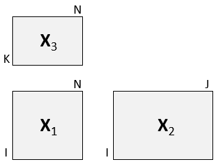

# L-PLS regression

Simultaneous decomposition of three blocks connected in an L pattern.

## Usage

``` r
lpls(
  X1,
  X2,
  X3,
  ncomp = 2,
  doublecenter = TRUE,
  scale = c(FALSE, FALSE, FALSE),
  type = c("exo"),
  impute = FALSE,
  niter = 25,
  subsetX2 = NULL,
  subsetX3 = NULL,
  ...
)
```

## Arguments

- X1:

  `matrix` of size IxN (middle matrix)

- X2:

  `matrix` of size IxJ (left matrix)

- X3:

  `matrix` of size KxN (top matrix)

- ncomp:

  number of L-PLS components

- doublecenter:

  `logical` indicating if centering should be done both ways for X1
  (default=TRUE)

- scale:

  `logical vector` of length three indicating if each of the matrices
  should be autoscaled.

- type:

  `character` indicating type of L-PLS ("exo"=default, "exo_ort" or
  "endo")

- impute:

  `logical` indicating if SVD-based imputation of missing data is
  required.

- niter:

  `numeric` giving number of iterations in component extraction loop.

- subsetX2:

  `vector` defining optional sub-setting of X2 data.

- subsetX3:

  `vector` defining optional sub-setting of X3 data.

- ...:

  Additional arguments, not used.

## Value

An object of type `lpls` and `multiblock` containing all results from
the L-PLS analysis. The object type `lpls` is associated with functions
for correlation loading plots, prediction and cross-validation. The type
`multiblock` is associated with the default functions for result
presentation
([`multiblock_results`](https://khliland.github.io/multiblock/reference/multiblock_results.md))
and plotting
([`multiblock_plots`](https://khliland.github.io/multiblock/reference/multiblock_plots.md)).

## Details

Two versions of L-PLS are available: exo- and endo-L-PLS which assume an
outward or inward relationship between the main block X1 and the two
other blocks X2 and X3.

The `exo_ort` algorithm returns orthogonal scores and should be chosen
for visual exploration in correlation loading plots. If exo-L-PLS with
prediction is the main purpose of the model then the non-orthogonal
`exo` type L-PLS should be chosen for which the predict function has
prediction implemented.



## References

- Martens, H., Anderssen, E., Flatberg, A.,Gidskehaug, L.H., Høy, M.,
  Westad, F.,Thybo, A., and Martens, M. (2005). Regression of a data
  matrix on descriptors of both its rows and of its columns via latent
  variables: L-PLSR. Computational Statistics & Data Analysis, 48(1),
  103 – 123.

- Sæbø, S., Almøy, T., Flatberg, A., Aastveit, A.H., and Martens, H.
  (2008). LPLS-regression: a method for prediction and classification
  under the influence of background information on predictor variables.
  Chemometrics and Intelligent Laboratory Systems, 91, 121–132.

- Sæbø, S., Martens, M. and Martens H. (2010) Three-block data modeling
  by endo- and exo-LPLS regression. In Handbook of Partial Least
  Squares: Concepts, Methods and Applications. Esposito Vinzi, V.; Chin,
  W.W.; Henseler, J.; Wang, H. (Eds.). Springer.

## See also

Overviews of available methods,
[`multiblock`](https://khliland.github.io/multiblock/reference/multiblock.md),
and methods organised by main structure:
[`basic`](https://khliland.github.io/multiblock/reference/basic.md),
[`unsupervised`](https://khliland.github.io/multiblock/reference/unsupervised.md),
[`asca`](https://khliland.github.io/HDANOVA/reference/asca.html),
[`supervised`](https://khliland.github.io/multiblock/reference/supervised.md)
and
[`complex`](https://khliland.github.io/multiblock/reference/complex.md).
Functions for computation and extraction of results and plotting are
found in
[`lpls_results`](https://khliland.github.io/multiblock/reference/lpls_results.md).

## Author

Solve Sæbø (adapted by Kristian Hovde Liland)

## Examples

``` r
# Simulate data set
sim <- lplsData(I = 30, N = 20, J = 5, K = 6, ncomp = 2)
X1  <- sim$X1; X2 <- sim$X2; X3 <- sim$X3
lp  <- lpls(X1,X2,X3) # exo-L-PLS
```
