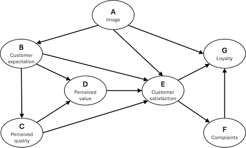

# ECSI Mobile Mobile Phone Provider Dataset

Mobile data questionnaire often used as an example in path modelling.
All the items are scaled from 1 to 10. Score 1 expresses a very negative
point of view on the product while score 10 a very positive opinion. For
details, see the original publication.



## Usage

``` r
data(mobile)
```

## Format

A data.frame having 250 rows and 7 variables:

- A:

  Image

- B:

  Customer expectation

- C:

  Perceived quality

- D:

  Perceived value

- E:

  Customer satisfaction

- F:

  Customer complaints

- G:

  Customer loyalty

## References

Tenenhaus M, Esposito Vinzi V, Chatelin YM, Lauro C. PLS path modeling.
Comput Stat Data Anal. 2005;48(1):159‐205.
