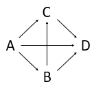

# Data simulated to have certain characteristics.

A dataset containing simulated data for 4 connected events where A is
the starting point and D is the end point. This can be described as a
directed acyclic graph (sketched below, moving left-\>right).\



Subpaths include: ABD, AD, ABCD, ACD

## Usage

``` r
data(simulated)
```

## Format

A list of matrices having 200 rows and 10 variables:

- A:

  Simulated matrix A

- B:

  Simulated matrix B

## References

Tormod Næs, Rosaria Romano, Oliver Tomic, Ingrid Måge, Age Smilde,
Kristian Hovde Liland, Sequential and orthogonalized PLS (SO-PLS)
regression for path analysis: Order of blocks and relations between
effects. Journal of Chemometrics, In Press
