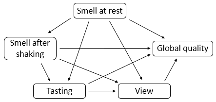

# Wines of Val de Loire

This dataset contains sensory assessment of 21 wines. The assessments
are grouped according to the tasting process and thus have a natural
ordering with a all blocks pointing forward to all remaining blocks in
the process.



## Usage

``` r
data(wine)
```

## Format

A data.frame having 21 rows and 5 variables:

- Smell at rest:

  Matrix of sensory assessments

- View:

  Matrix of sensory assessments

- Smell after shaking:

  Matrix of sensory assessments

- Tasting:

  Matrix of sensory assessments

- Global quality:

  Matrix of sensory assessments

## References

Escofier B, Pages L. Analyses Factorielles Simples and Multiples. Paris:
Dunod; 1988.
